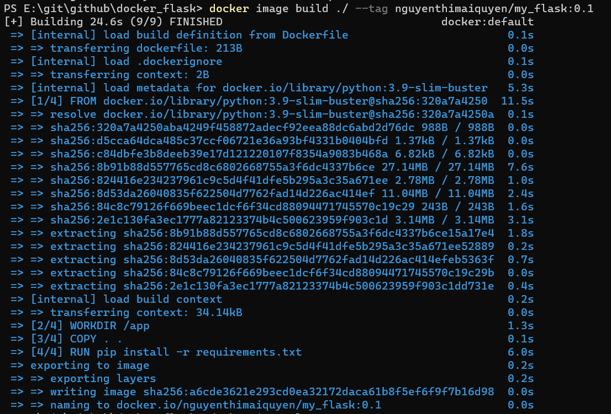
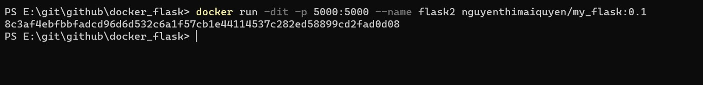
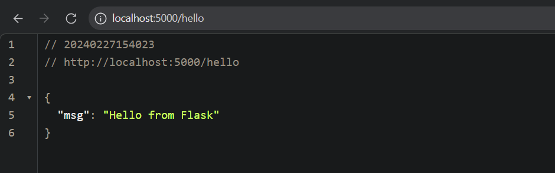

# docker

Bài 1: Viết Dockerfile và build image với các yêu cầu sau:

- Viết Dockerfile cho ứng dụng python: (xem Dockerfile)
- Build image từ Dockerfile trên và đặt tag theo format sau: docker_hub_username/image_name:version (ví dụ: thinhbui/my_flask:0.1)
  docker image build ./ --tag nguyenthimaiquyen/my_flask:0.1
  
- Chạy ứng dụng tại đường dẫn /hello
  docker run -dit -p 5000:5000 --name flask1 nguyenthimaiquyen/my_flask:0.1
  

  kết quả:
  

Bài 3:
Mạng bridge mặc định và mạng bridge do người dùng tự tạo trong Docker có một số điểm khác biệt cơ bản:

- Mạng Bridge Mặc Định:
  Docker cung cấp một mạng bridge mặc định có tên là "bridge" cho mỗi máy chủ Docker.
  Mỗi container được khởi chạy trên mạng bridge mặc định sẽ được gán một địa chỉ IP duy nhất từ dải mạng private của mạng bridge đó.
  Containers trên cùng một mạng bridge mặc định có thể giao tiếp với nhau qua IP của container.

- Mạng Bridge Do Người Dùng Tạo:
  Người dùng có thể tạo các mạng bridge tùy chỉnh bằng cách sử dụng lệnh docker network create.
  Khi tạo mạng bridge tùy chỉnh, người dùng có thể cấu hình các thuộc tính như địa chỉ subnet, gateway, driver, ...
  Containers có thể được gán vào các mạng bridge do người dùng tạo bằng cách sử dụng tùy chọn --network khi chạy lệnh docker run.
  Containers trên cùng một mạng bridge tùy chỉnh có thể giao tiếp với nhau qua tên container hoặc tên service (nếu container được khởi chạy như một dịch vụ trong Docker Swarm) thay vì qua địa chỉ IP.
